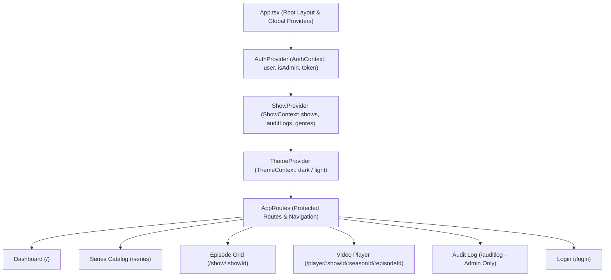

<<<<<<< ours
# Stream-Player Frontend Documentation

A modern, responsive, and feature-rich Single Page Application (SPA) built with **React 19**, **TypeScript**, and **Vite**. It provides a sleek streaming interface with dynamic video playback, HLS/DASH streaming capabilities, season/episode navigation, dark/light theme switching, and strict Role-Based Access Control (RBAC).

---

## Table of Contents
1. [Architecture & Technology Stack](#1-architecture--technology-stack)
2. [Folder & Module Structure](#2-folder--module-structure)
3. [State Management & Contexts](#3-state-management--contexts)
4. [Routing & Navigation](#4-routing--navigation)
5. [RBAC Implementation in UI](#5-rbac-implementation-in-ui)
6. [Video Player & Streaming Engine](#6-video-player--streaming-engine)
7. [API Service Layer](#7-api-service-layer)
8. [Installation & Setup](#8-installation--setup)

---

## 1. Architecture & Technology Stack

- **Framework**: React 19.2.8 with React Compiler support
- **Language**: TypeScript (~6.0.2)
- **Build Tool**: Vite 8.2.2
- **Router**: React Router DOM v7.18.2
- **Player**: `react-player` (v3.4.0) + HLS / DASH support
- **Styling**: Vanilla CSS with modern Glassmorphism & Custom CSS variables
- **Linter**: Oxlint (Oxc)



---

## 2. Folder & Module Structure

```text
Stream-Player/frontend/src/
├── App.tsx                     # Global context provider nesting and root layout
├── main.tsx                    # React DOM entry point
├── index.css                   # Global theme tokens, typography, scrollbars, animations
├── types/
│   └── media.ts                # TypeScript interfaces (Show, Season, Episode, Genre, etc.)
├── Services/
│   └── Api.ts                  # Centralized REST client, Basic Auth helper, media URL resolver
├── contexts/
│   ├── AuthContext.tsx         # User authentication, role resolution (admin vs user), session persistence
│   ├── ShowContext.tsx         # Show/Season/Episode state, CRUD mutations, audit log state
│   └── ThemeContext.tsx        # Dark/Light theme switching with localStorage persistence
├── Layouts/
│   └── AppLayout/              # Persistent Sidebar + dynamic outlet container
├── components/
│   ├── Sidebar/                # Main navigation bar with role badge and theme toggler
│   ├── ProtectedRoute/         # Route guards for authentication and admin-only access
│   ├── ShowCard/               # Reusable poster card with hover animations
│   ├── ShowModal/              # Multipart form modal for adding/editing series, seasons, and episodes
│   ├── EpisodeModal/           # Episode details & file upload modal
│   ├── SeasonSelector/         # Horizontal interactive season tabs
│   ├── EpisodeCard/            # Episode item component with thumbnail and description
│   ├── NextEpisodes/           # Up-next episode recommendations carousel in player
│   └── VideoPlayer/            # Custom HTML5 / react-player video player with playback controls
└── pages/
    ├── Dashboard/              # Hero showcase and popular series grid
    ├── Series/                 # Full series catalog, search, and admin CRUD controls
    ├── EpisodeGrid/            # Show details, season selector, episode list, and upload actions
    ├── Player/                 # Fullscreen immersive video streaming experience
    ├── AuditLog/               # System audit log viewer with clear-all capabilities (Admin Only)
    └── Login/                  # Glassmorphic user login portal
```

---

## 3. State Management & Contexts

### 1. `AuthContext` ([`contexts/AuthContext.tsx`](file:///c:/Users/T480/Desktop/streamPlayer/Stream-Player/frontend/src/contexts/AuthContext.tsx))
- Manages authenticated user state (`user: { id, username, email, role, is_staff, is_superuser }`).
- Authenticates against `/api/auth/me/` and saves token in `localStorage`.
- Computes `isAdmin = Boolean(user && (user.role === 'admin' || user.is_staff || user.is_superuser))`.
- Validates session integrity in the background upon page reload.

### 2. `ShowContext` ([`contexts/ShowContext.tsx`](file:///c:/Users/T480/Desktop/streamPlayer/Stream-Player/frontend/src/contexts/ShowContext.tsx))
- Central store for shows, seasons, episodes, audit logs, and genres.
- Exposes async actions: `addShow`, `updateShow`, `deleteShow`, `addSeason`, `deleteSeason`, `addEpisode`, `updateEpisode`, `deleteEpisode`, `createGenre`, `clearAuditLogs`.
- Guards mutations with client-side admin validation before dispatching to API.

### 3. `ThemeContext` ([`contexts/ThemeContext.tsx`](file:///c:/Users/T480/Desktop/streamPlayer/Stream-Player/frontend/src/contexts/ThemeContext.tsx))
- Switches between `dark` and `light` themes by setting `data-theme` on the document root element.

---

## 4. Routing & Navigation

| Path | Component | Access Level | Description |
| :--- | :--- | :--- | :--- |
| `/login` | `Login` | Public | Credentials authentication page |
| `/` | `Dashboard` | Authenticated | Featured hero banner & series catalog |
| `/series` | `Series` | Authenticated | Grid view of all series |
| `/show/:showId` | `EpisodeGrid` | Authenticated | Seasons tabs and episode list |
| `/player/:showId/:seasonId/:episodeId` | `Player` | Authenticated | Video playback with controls and next-up queue |
| `/auditlog` | `AuditLog` | **Admin Only** | Administrative system activity audit trail |

---

## 5. RBAC Implementation in UI

The UI adapts dynamically based on whether the logged-in user is an **Admin** or a **Regular User**:

1. **Series Page ([`pages/Series/Series.tsx`](file:///c:/Users/T480/Desktop/streamPlayer/Stream-Player/frontend/src/pages/Series/Series.tsx))**:
   - `+ Add Series` button is only visible to admins.
   - `✏️ Edit` and `🗑️ Delete` action buttons on cards are hidden for regular users.
   - Regular users can only click to browse seasons and watch episodes.
2. **Episode Grid Page ([`pages/EpisodeGrid/EpisodeGrid.tsx`](file:///c:/Users/T480/Desktop/streamPlayer/Stream-Player/frontend/src/pages/EpisodeGrid/EpisodeGrid.tsx))**:
   - `⚙️ Edit Series & Episodes` and `+ Upload Episode` are strictly hidden for regular viewers.
3. **Sidebar Navigation ([`components/Sidebar/Sidebar.tsx`](file:///c:/Users/T480/Desktop/streamPlayer/Stream-Player/frontend/src/components/Sidebar/Sidebar.tsx))**:
   - The `Audit Log` navigation link is rendered only for admins.
   - An active profile chip displays the current user's role: `👤 username [USER]` or `👤 username [ADMIN]`.
4. **Route Protection ([`components/ProtectedRoute/ProtectedRoute.tsx`](file:///c:/Users/T480/Desktop/streamPlayer/Stream-Player/frontend/src/components/ProtectedRoute/ProtectedRoute.tsx))**:
   - Non-admin attempts to access `/auditlog` automatically redirect to the home page (`/`).

---

## 6. Video Player & Streaming Engine

The video player component ([`components/VideoPlayer/VideoPlayer.tsx`](file:///c:/Users/T480/Desktop/streamPlayer/Stream-Player/frontend/src/components/VideoPlayer/VideoPlayer.tsx)):
- Supports standard MP4 video files, HLS (`.m3u8`), and DASH (`.mpd`) video streams.
- Interactive controls: play/pause, scrub bar, volume, playback speed (0.5x - 2x), theater/fullscreen toggle.
- Automatically saves playback progress to the backend `/api/watchhistory/` periodically.
- Auto-advances to the next episode upon completion.

---

## 7. API Service Layer

The REST client in [`Services/Api.ts`](file:///c:/Users/T480/Desktop/streamPlayer/Stream-Player/frontend/src/Services/Api.ts):
- Handles Basic Authentication headers and JWT tokens.
- Supports `multipart/form-data` uploads for video files, poster art, and banners with browser boundary detection.
- `resolveMediaUrl()` utility constructs full HTTP paths for media files served by Django (`http://localhost:8000/media/...`).

---

## 8. Installation & Setup

```bash
# 1. Navigate to frontend directory
cd Stream-Player/frontend

# 2. Install npm dependencies
npm install

# 3. Start Vite development server
npm run dev
```

The application will be accessible at: `http://localhost:5173/`
||||||| base
=======
# Video_Streaming_Platform
>>>>>>> theirs
